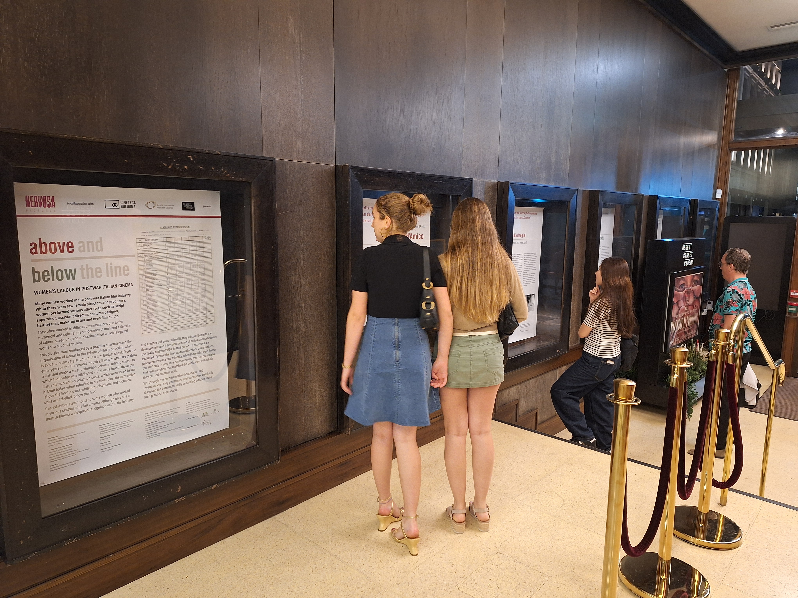
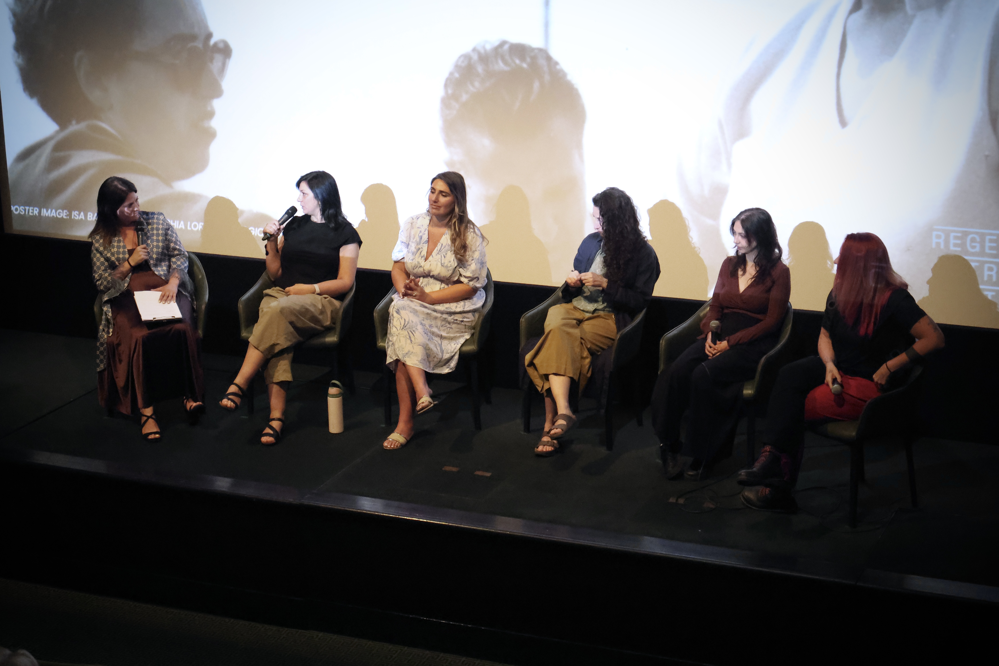
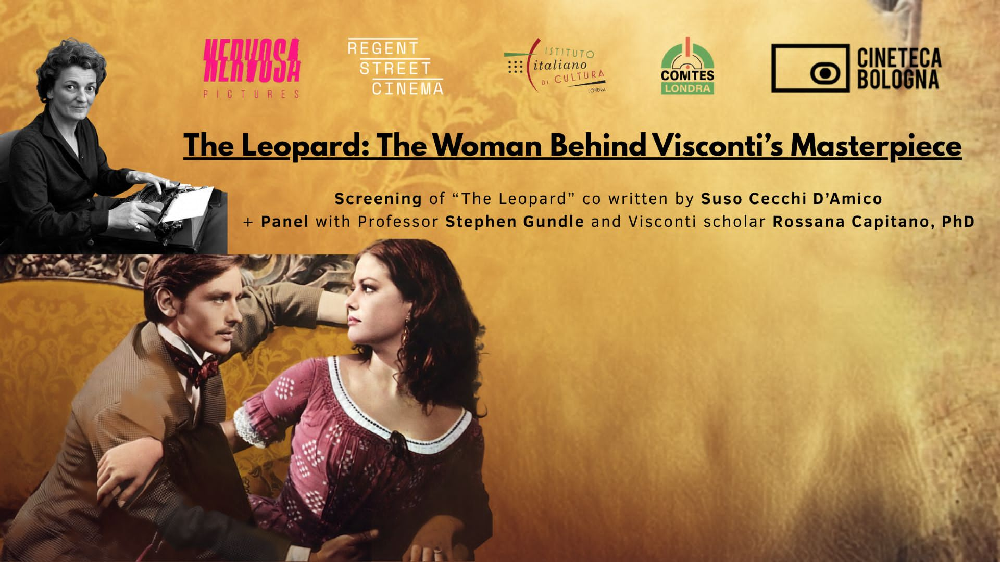

## Exhibition and Events

*Visitors to the exhibition at the Regent Street Cinema, London.*

*Alessandra Gonella (left) conducts a round table with young women industry professionals at the inauguration event of the exhibition, 3 July 2026.*

*To accompany a screening of Visconti's film The Leopard at Regent Street Cinema on 10 July 2026, Stephen Gundle discussed the contribution of screenwriter Suso Cecchi d'Amico with Visconti expert Rossana Capitano, who interviewed Suso in 2002.*

[Listen to the accompanying voice recording](Voice-260710_193819.m4a)
